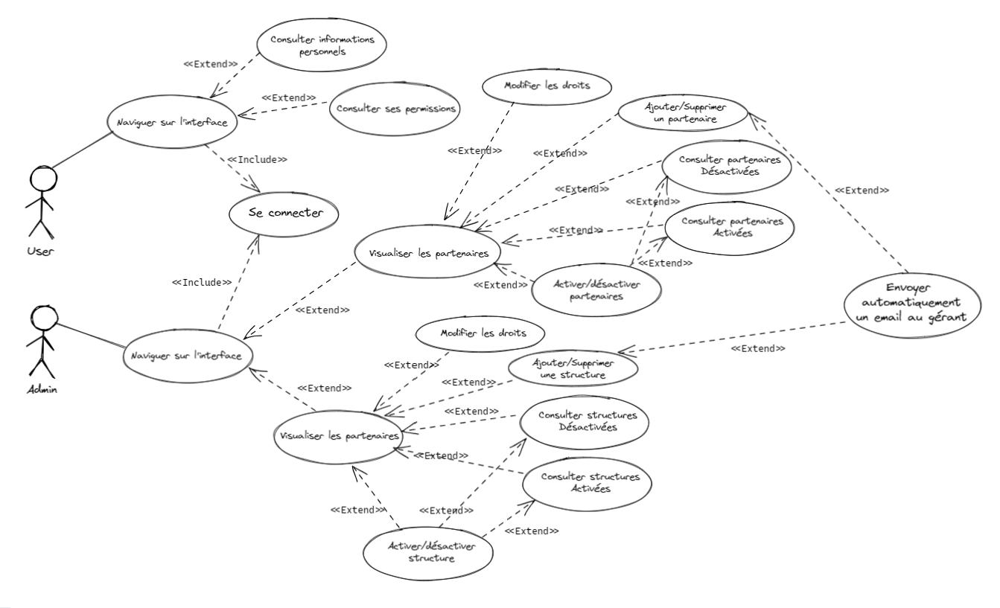

# ECF_2022_FRONT

___
Réaliser dans le cadre de L'ECF.

Stack : VUE3JS , PINIA, VUE-ROUTER, TS
Authentification : utilisation du token JWT - durée 10min.

___


### UseCase : 
*Réalisé avec Excalidraw*


### Code Couleur :
*Réalisé avec Figma*


### Architecture de l'application :
*Réalisé avec Excalidraw*


___

### Télécharger le projet ? 

__Marche à suivre :__

```bash
git clone https://github.com/Warolucky24/ECF_STUDI_2022_FRONT.git
cd ECF_STUDI_2022_FRONT
npm i
npm run dev
```
