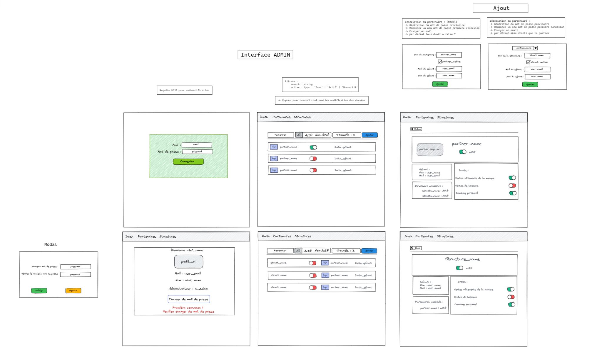
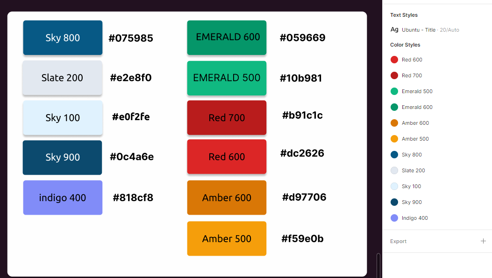
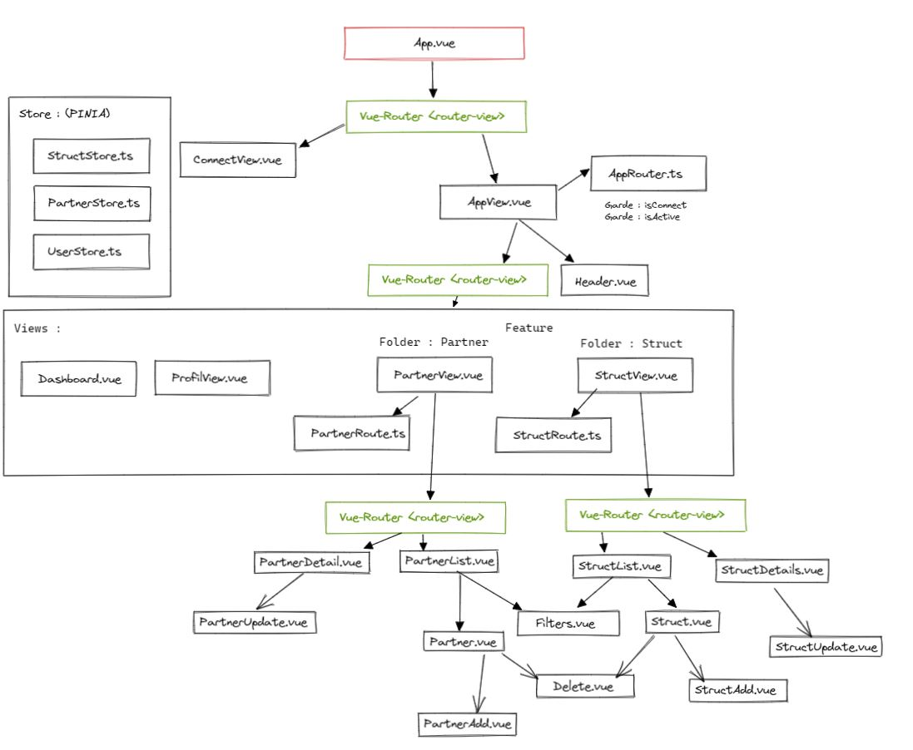

# ECF_2022_FRONT

___
Réalisé dans le cadre de L'ECF.

Stack : VUE3JS , PINIA, VUE-ROUTER, TS /
Authentification : utilisation du token JWT - durée 10min.

___

### Table of content :


1. [Gestion du projet](#gestion-du-projet-)
2. [UseCase](#usecase-)
3. [UserStory](#userstory-)
4. [Code Couleur](#code-couleur-)
5. [Architecture des Composants](#architecture-des-composants-)
6. [Télécharger le projet](#tlcharger-le-projet-)

___
## Gestion du projet :
Réalisé sur **Notion** : [Lien](https://mathieu24dev.notion.site/ECF_DECEMBER_2022-780e5716ca9e43c6bca8340fc0dfb2cb)
___


### UseCase : 
*Réalisé avec Excalidraw*


### UserStory : 
*Réalisé avec Excalidraw*



### Nuancier de couleurs :
*Réalisé avec Figma*


### Architecture des composants :
*Réalisé avec Excalidraw*



___

### Télécharger le projet ? 

__Marche à suivre :__

```bash
git clone https://github.com/Warolucky24/ECF_STUDI_2022_FRONT.git
cd ECF_STUDI_2022_FRONT
npm i
npm run dev
```
